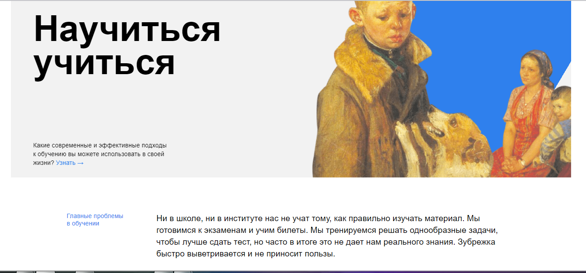

# Hi, my name is Aishat Safin.

## This project is a **"How to Learn"** website.

This is my first project and I tried to make it interesting. It focuses on learning and memorization techniques. By visiting this site you will learn what techniques exist, how easy it is to memorize and assimilate new information. On my site you can find interesting facts, short articles, links to literature, as well as entertaining videos.

##

To view the site, you just need to download it in an archived form or through a link using GIT commands.
Also, to view the site, you just need to download it in archived form or through the link.

- [link to viewe on Github](https://github.com/homo-errantium/how_to_study)

- [link to viewe on Github Pages](https://homo-errantium.github.io/how_to_study/)

### Technologies:

This is a simple and informative site with the ability to follow links, with playback of video content. **It uses HTML and CSS. There is also a simple animation based on CSS.** It uses only a few fonts and colors. All project structuring by _BEM-system_ However, the site is tasteful, organic and friendly looking. You can find more interesting projects at _[my page](https://github.com/homo-errantium/)_

### Plan/Status:

The project is completed and does not require any further work. However, I plan to add a few more pages to make the site multi-page.
